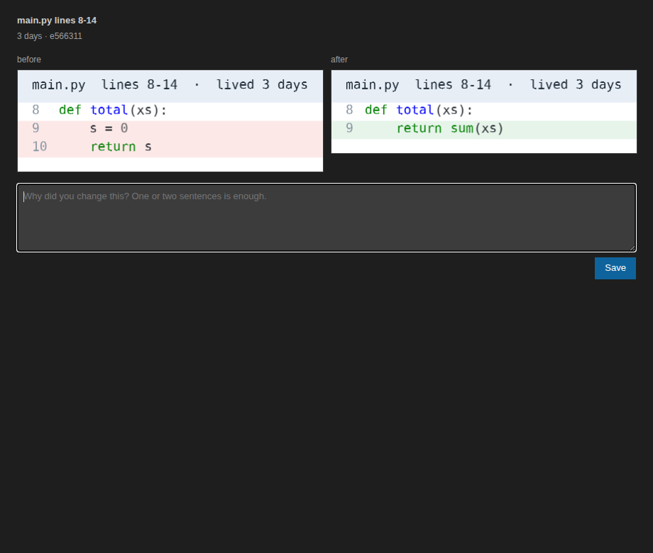

# decap

decap saves a before image and an after image when a commit changes a line that last changed hours ago. Each capture is a folder with those images and a note where you write why.

## Requirements

Git. The extension does not need Python. On Windows, install Git for Windows. A commit made while the editor is closed is saved when you open the editor again.

The command-line tool in this repository is separate. It needs Python 3.11 or newer and a post-commit hook. Use it when you want captures from a terminal with no editor open.

## First run

Install the extension and open a folder that contains a git repository. The repository can be that folder, or the folder directly inside it. There is no setup step. A commit that changes a line at least 12 hours old is saved under `.decisions` in the repository. That includes a commit made while the editor was closed. A rebase keeps a reason you already wrote. decap does not ask for that reason again.

## Commands

`decap: Snap` captures the working tree against HEAD, including lines younger than 12 hours. The default key is Alt+Shift+S.

`decap: Open decisions` opens the sidebar.

`decap: Show log` opens the decap output channel. It records each repository and, for every new commit, either the capture or the reason nothing was saved.

`decap: Fill in why` opens a form for the newest capture from this session that still has no reason.

`decap: Review last commit` captures HEAD even when the lines are younger than 12 hours. It says when the commit only added lines, is a merge, or is the first commit. If that change was already captured, it opens the form that is already there.

## When nothing is captured

A commit that does not change an old line leaves a status bar message for 20 seconds. The message names the reason. A line younger than 12 hours, a commit that only adds lines, a merge, and a change that was already captured each get their own reason. When the only reason is age, a notification says how old the lines are and offers Review anyway. An age under a minute reads less than a minute, on the notification, the images, and the form. The same short sentence is the status bar message, and clicking it reviews the commit. Review anyway writes the capture, marks the note `young: true`, and opens Fill in why without a second notification. A change that was already reviewed does not offer Review anyway. A later click opens the form that is already there. A later normal capture of that same change writes nothing.

## Sidebar

The Decisions view lists `.decisions` folders from the git repository, newest first. Before any capture it explains that a capture appears after you commit a change to an old line. Select one to see the before image and the after image stacked. Edit the Why box and leave the field to save `note.md`. The same text appears in the Fill in why form.

A new capture shows a notification with Fill in why. That opens a form in the editor, focused on the reason, and selects the capture in the sidebar. The form shows the file name, the line range, how old the line was, a short commit hash, and the two images. Save stores the reason. If other captures from this session still need a reason, the form moves to the next one. Escape or closing the form leaves the reason empty. The status bar keeps `decap: fill in why` until a reason is saved.

`note.md` is a short heading, the reason you wrote, and the two images. The machine-readable fields stay in an HTML comment at the bottom. Opening that file from decap uses the text editor.

Images use DejaVu Sans Mono, which is bundled with the extension. DejaVu is based on Bitstream Vera. The font license is `media/DejaVu-LICENSE.txt`.
